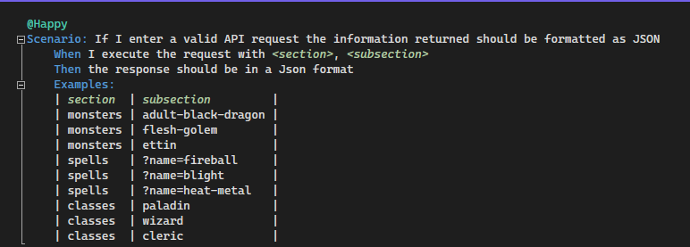

# Automated API testing project

## This is an automateed API testiing project utilizing the [D&D 5e API](https://www.dnd5eapi.co/docs/#overview)

### CI Badge

[](https://github.com/MugillaGurilla/APi-Project/actions/workflows/CIMerge.yml)

### Project Board

[Github Project Board](https://github.com/users/MugillaGurilla/projects/1)

### Epics?

### Deliverables

- [X] Complete Test framework for the REST API chosen
- [X] Happy and sad path tests
- [X] Tests written with SpecFlow
- [X] Must use HttpClient
- [ ] Using Dependency injection in the framework (optional)
- [X] **Actually** use Github
- [ ] Use Moq to test helper method (optional)
- [x] Github Workflow (optional)
- [X] 6 columns - Product Backlog, Sprint Backlog, In progress, In review, Done, Notes
- [x] Include Project Goal and project DoD in notes
- [X] test case for each user story
- [X] create user stories
- [X] User stories should be written from the perspective of the user
- [x] Detailed README including an extensive explanation on how to use the framework

### Framework


### How the framework functions

There are three folders within the project, DataHandling, HttpManager and Services. Broadly speaking, the **DataHandling** folder
deals with deserialising JSON responses into C# objects, **HttpManager** deals with making API requests, but only in a generic sense.
**Services** is more granular and details the actual nuances of a Spell, Monster or DnD Class service.

A goal of this framework was to keep everything generic right up until the point where it could no longer be, allowing the frameowrk
to be extensible.

### DataHandling

Within the Models folder, there are C# object definitions for the each service. `DTO.cs` uses Newtonsoft to deserialise API responses from JSON to
a C# object. For example, `DndClass.cs` calls `CallManager.cs` which deserialises to a `DndClassReponse.cs` object. `IResponse.cs` is
merely used to implement generic types, see line 6 of `DTO.cs`

```
public class DTO<T> where T : IResponse, new()
```

### HttpManager

This class utilises HttpClient to actually execute an API request. The `MakeARequestAsync` function ultimately returns the JSON
response as an unformatted string. This is then turned into a JObject and the relevant C# object.

### Services

Some service behaviour is defined with `Services.cs` and `IService.cs` but service behaviour is fully fleshed out within the
individual classes of `DndClass.cs`, `Spell.cs` and `Monster.cs`. All of which inherit from IService and Services. The main goal of
`IService.cs` is to group all services together and implement generic types. MakeAServices() is an important function that allows
the tests to be reusable. It is utilised within the BDD folder in `SharedSteps.cs`. Ultimately, this allows the program to reuse the
same tests for many different API calls.



### SharedSteps.cs

The individual step definitions simply contain different Assert.That() functions. However, the heavy-lifting in regard to tests in `SharedSteps`.
To start a `Services` object and `IServices` interface are instantiated. Within the Then statement, the
`IService` interface is turned from a generic interface to specific service, becoming a Monster, Spell or DndClass service. The `section` argument
is key to this and is used within
an if statement in MakeAService() in `Services.cs`. With the service's full behaviour now defined, an API call is made using MakeARequestAsync().

class diagram here
above class diagram should explain how the framework functions

instuctions on how you would collaborate further with the project if there was a group taking over the groups work.

------

### 💭 Definitions of Done

Our definitions of Done [can be found here](https://github.com/users/MugillaGurilla/projects/1/views/1?pane=issue&itemId=25643413)

### 💭 Definition of Ready

Our definitions of Ready [can be found here](https://github.com/users/MugillaGurilla/projects/1/views/1?pane=issue&itemId=25643451)

### Contributors

Cormac Porter, Samuel Burton, Man Him Yeung, Gharzay Wali, Ali Cengiz
